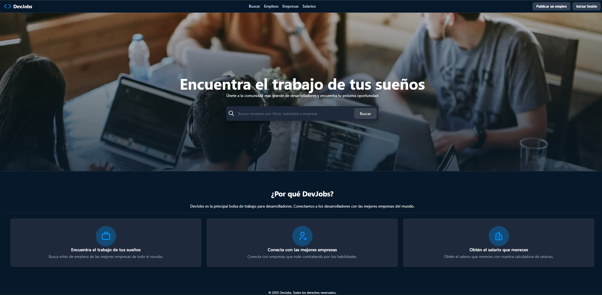

# DevJobs React

Job board para desarrolladores latinomericanos. Buscá empleos por tecnología, ubicación y nivel de experiencia.

## Screenshot



## Tech Stack


- **React** 19.2.4 con React Compiler
- **Vite** 8.0.1
- **React Router** 7.14.1
- **Zustand** 5.0.12
- **snarkdown** 2.0.0

## Features

- Buscador con filtros por tecnología, ubicación y nivel de experiencia
- Búsqueda con debounce de 500ms
- Paginación de resultados
- Detalle completo de cada empleo con rendering de Markdown
- Diseño responsive
- Navegación fluida con React Router

## API

Este proyecto consume la **DevJobs API** (https://dev-jobs-api-sepia.vercel.app/jobs) creada por [Ramiro Zarate](https://github.com/Ramiro-Zarate).

Endpoints disponibles:

| Método | Endpoint | Descripción |
|--------|----------|-------------|
| GET | `/jobs` | Listado de empleos con filtros |
| GET | `/jobs/{jobId}` | Detalle de un empleo específico |

Parámetros de búsqueda:

- `text` - Búsqueda por texto
- `technology` - Filtrar por tecnología
- `location` - Filtrar por ubicación
- `level` - Filtrar por nivel de experiencia
- `limit` - Resultados por página
- `offset` - Offset para paginación

## Instalación

```bash
npm install
npm run dev
```

## Scripts

| Script | Descripción |
|--------|-------------|
| `npm run dev` | Iniciar servidor de desarrollo |
| `npm run build` | Construir versión de producción |
| `npm run lint` | Verificar código con ESLint |
| `npm run preview` | Previsualizar versión de producción |

---

Desarrollado por **Ramiro Zarate**